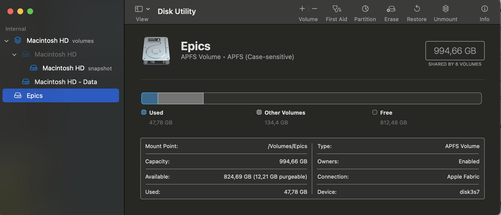

# Configuring RTEMS 6

```{tags} developer, advanced
```

## RTEMS 6 Information

Unfortunately, RTEMS 6 has not yet been released at the time of writing. This page provides a advice on using the RTEMS Source Builder to build the RTMEMS tools, kernel and 3rd party packages from source. The process for creating this environment is documented [here] (https://docs.rtems.org/branches/master/user/rsb/index.html#). If you discover any other information that ought to be published here, please [let me know](mailto:junkes@fhi.mpg.de).

Please note that we are specifically addressing the hardware used in the EPICS environment, primarily with RTEMS.

*   VMEbus CPUs (MVME3100, MVME6100, MVME2500)
*   Development boards (Beagleboneblack, ZYBO Z7-20, ...)
*   Qemu - Support e.g. xilinx\_zynq\_a9\_qemu

In order to support these systems, the tools for the *arm* and *powerpc* architectures must be installed.

The environment was installed on an M2 Mac. It is helpful to create a virtual hard disc with a case-sensitive APFS file system (e.g. /Volumes/Epics): 

The following installation script refers to a path in this volume.

``` 
junkes@Zarquon RTEMS_FOR_EPICS % pwd
/Volumes/Epics/LONG_ISLAND/RTEMS_FOR_EPICS
junkes@Zarquon RTEMS_FOR_EPICS % more INSTALLING_6 
#!/bin/bash
# ----
# RTEMS6 tools for arm architecture
# ----

export RTEMS_VERSION=6
export RTEMS_CPU=arm
export RTEMS_ARCH=${RTEMS_CPU}-rtems${RTEMS_VERSION}
export RTEMS_ROOT=/Volumes/Epics/LONG_ISLAND/RTEMS_FOR_EPICS/rtems/${RTEMS_VERSION}

#install rsb and rtems arm tools
git clone https://gitlab.rtems.org/rtems/tools/rtems-source-builder.git  rsb
cd rsb/rtems
../source-builder/sb-check
if [ $? -ne 0 ]; then
    echo "sb check failed"
    exit
fi
echo "... check ok ... proceed ..."
../source-builder/sb-set-builder --list-bsets
echo "... building tool set for " ${RTEMS_CPU}
../source-builder/sb-set-builder --warn-all --log --no-clean --with-python-version=python3.12 --prefix=${RTEMS_ROOT} ${RTEMS_VERSION}/rtems-${RTEMS_CPU}
if [ $? -ne 0 ]; then
    echo "building failed"
    exit
fi
```
In */Volumes/Epics/LONG_ISLAND/RTEMS\_FOR\_EPICS/rtems/6/bin* you should find the arm-tools:

```
junkes@Zarquon RTEMS_FOR_EPICS % ls rtems/6/bin 
arm-rtems6-addr2line		arm-rtems6-ld			mkimage.py
arm-rtems6-ar			arm-rtems6-ld.bfd		rtems-addr2line
arm-rtems6-as			arm-rtems6-lto-dump		rtems-bin2c
arm-rtems6-c++			arm-rtems6-nm			rtems-boot-image
arm-rtems6-c++filt		arm-rtems6-objcopy		rtems-bsp-builder
arm-rtems6-cpp			arm-rtems6-objdump		rtems-exeinfo
arm-rtems6-elfedit		arm-rtems6-ranlib		rtems-ld
arm-rtems6-g++			arm-rtems6-readelf		rtems-ra
arm-rtems6-gcc			arm-rtems6-run			rtems-rap
arm-rtems6-gcc-13.3.0		arm-rtems6-size			rtems-record-lttng
arm-rtems6-gcc-ar		arm-rtems6-strings		rtems-run
arm-rtems6-gcc-nm		arm-rtems6-strip		rtems-syms
arm-rtems6-gcc-ranlib		convert-dtsv0			rtems-test
arm-rtems6-gcov			dtc				rtems-tftp-proxy
arm-rtems6-gcov-dump		dtdiff				rtems-tftp-server
arm-rtems6-gcov-tool		fdtdump				rtems-tld
arm-rtems6-gdb			fdtget				trace-converter
arm-rtems6-gdb-add-index	fdtoverlay
arm-rtems6-gprof		fdtput
```

Now you can use the same script (except git clone) for other architectures  by adapting *RTEMS_CPU*. e.g:

`
export RTEMS_CPU=powerpc
`

After that (! takes a little longer) you have also created tools for the *powerpc* architecture:

```
junkes@Zarquon RTEMS_FOR_EPICS % ls rtems/6/bin 
arm-rtems6-addr2line		arm-rtems6-strings		powerpc-rtems6-ld
arm-rtems6-ar			arm-rtems6-strip		powerpc-rtems6-ld.bfd
arm-rtems6-as			convert-dtsv0			powerpc-rtems6-lto-dump
arm-rtems6-c++			dtc				powerpc-rtems6-nm
arm-rtems6-c++filt		dtdiff				powerpc-rtems6-objcopy
arm-rtems6-cpp			fdtdump				powerpc-rtems6-objdump
arm-rtems6-elfedit		fdtget				powerpc-rtems6-ranlib
arm-rtems6-g++			fdtoverlay			powerpc-rtems6-readelf
arm-rtems6-gcc			fdtput				powerpc-rtems6-run
arm-rtems6-gcc-13.3.0		mkimage.py			powerpc-rtems6-size
arm-rtems6-gcc-ar		powerpc-rtems6-addr2line	powerpc-rtems6-strings
arm-rtems6-gcc-nm		powerpc-rtems6-ar		powerpc-rtems6-strip
arm-rtems6-gcc-ranlib		powerpc-rtems6-as		rtems-addr2line
arm-rtems6-gcov			powerpc-rtems6-c++		rtems-bin2c
arm-rtems6-gcov-dump		powerpc-rtems6-c++filt		rtems-boot-image
arm-rtems6-gcov-tool		powerpc-rtems6-cpp		rtems-bsp-builder
arm-rtems6-gdb			powerpc-rtems6-elfedit		rtems-exeinfo
arm-rtems6-gdb-add-index	powerpc-rtems6-g++		rtems-ld
arm-rtems6-gprof		powerpc-rtems6-gcc		rtems-ra
arm-rtems6-ld			powerpc-rtems6-gcc-13.3.0	rtems-rap
arm-rtems6-ld.bfd		powerpc-rtems6-gcc-ar		rtems-record-lttng
arm-rtems6-lto-dump		powerpc-rtems6-gcc-nm		rtems-run
arm-rtems6-nm			powerpc-rtems6-gcc-ranlib	rtems-syms
arm-rtems6-objcopy		powerpc-rtems6-gcov		rtems-test
arm-rtems6-objdump		powerpc-rtems6-gcov-dump	rtems-tftp-proxy
arm-rtems6-ranlib		powerpc-rtems6-gcov-tool	rtems-tftp-server
arm-rtems6-readelf		powerpc-rtems6-gdb		rtems-tld
arm-rtems6-run			powerpc-rtems6-gdb-add-index	trace-converter
arm-rtems6-size			powerpc-rtems6-gprof
```

Once the tools have been installed, the RTEMS kernel must now be created for the various boards. This can also be done with the RTEMS source builder, but also manually ([RTEMS docs](https://docs.rtems.org/branches/master/user/start/bsp-build.html#)).

Example RTEMS source builder (MVME2500, in *rsb/rtems*):

```
#!//bin/bash

export RTEMS_VERSION=6
export RTEMS_CPU=powerpc
export RTEMS_BSP=qoriq_e500
export RTEMS_ARCH=${RTEMS_CPU}-rtems${RTEMS_VERSION}
export RTEMS_ROOT=/Volumes/Epics/LONG_ISLAND/RTEMS_FOR_EPICS/rtems/${RTEMS_VERSION}

echo "... building kernel set for " ${RTEMS_CPU}/${RTEMS_BSP}

../source-builder/sb-set-builder --jobs=20 --prefix=${RTEMS_ROOT} \
--target=${RTEMS_CPU}-rtems${RTEMS_VERSION} \
--with-rtems-bsp=${RTEMS_CPU}/${RTEMS_BSP} \
--with-rtems-tests=yes ${RTEMS_VERSION}/rtems-kernel

if [ $? -ne 0 ]; then
    echo "building failed"
    exit
fi

```
To find out which BSPs are supported by the RTEMS source builder:
`
source-builder/sb-set-builder --list-bsets
`

Example manualy (MVME6100, in */Volumes/Epics/LONG_ISLAND/RTEMS\_FOR\_EPICS*):

```
#!/bin/bash

export RTEMS_VERSION=6
export RTEMS_CPU=powerpc
export RTEMS_BSP=beatnik
export RTEMS_ARCH=${RTEMS_CPU}-rtems${RTEMS_VERSION}
export RTEMS_ROOT=/Volumes/Epics/LONG_ISLAND/RTEMS_FOR_EPICS/rtems/${RTEMS_VERSION}

export PATH=${RTEMS_ROOT}/bin:${PATH}
echo ${PATH}

# building kernel
https://gitlab.rtems.org/rtems/rtos/rtems.git
cd kernel
./waf bspdefaults --rtems-bsps=${RTEMS_CPU}/${RTEMS_BSP} > config.ini
sed -i '' \
-e "s|RTEMS_POSIX_API = False|RTEMS_POSIX_API = True|" \
-e "s|BUILD_TESTS = False|BUILD_TESTS = True|" \
config.ini

./waf configure --prefix=${RTEMS_ROOT}
./waf
./waf install

```
To find out which BSPs are supported by the RTEMS kernel:

`
rtems-bsps 
`

Now we can create the other BSPs (with the RTEMS source builder mode).

```
./waf bspdefaults --rtems-bsps=arm/beagleboneblack > config.ini
sed -i ...
./waf confgiure ...
./waf
./waf install

./waf bspdefaults --rtems-bsps=arm/xilinx_zynq_a9_qemu >config.ini

./waf bspdefaults --rtems-bsps=powerpc/mvme3100 >config.ini

```

Now we can select the desired network stack per BSP. The following are available:

* Legacy network stack, supports old network drivers, old cards 
* LibBSD stack, requires Nexus drivers for network interfaces, prerequisite for e.g. NFSv3

1. MVME6100 with legacy stack:

```
../source-builder/sb-set-builder --jobs=20 --prefix=${RTEMS_ROOT} ${RTEMS_VERSION}/rtems-net-legacy --host=powerp-rtems6 --with-rtems-bsp=powerpc/beatnik  

!!! Error in Script ... wait for fix by RTEMS-group
```

2. MVME2500 with libBsd stack:

```

!!! Error in Script ... wait for fix by RTEMS-group
```


### Configuring image/run 

not done ...
